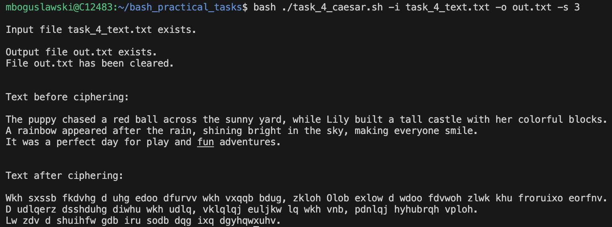
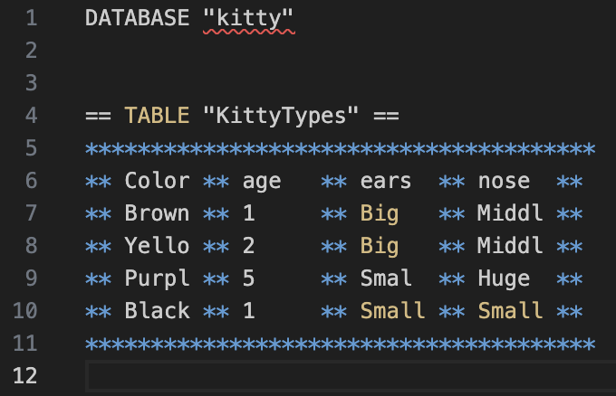

# bash_practical_tasks


## Task 1 - Fibonacci


## Task 2 - Math operations


## Task 3 - FizzBuzz


## Task 4 - Cipher



## Task 5 - String functionality


## Task 6 - Report


## Task Advanced — Bash-Based Text Database Utility

**`task_advanced.sh`** is a lightweight shell script that simulates a simple database system using Bash commands. It allows you to create databases, define tables, insert/select/delete data, and manage structured text-based records — all from the command line.

---

### Features

- Pure Bash implementation (no external dependencies)
- Flat-file database format
- Structured table output
- Field/value validation with error handling
- Easy-to-use command interface

---

### Function Overview

#### `create_db <db_name>`
Creates a new database file named `<db_name>`.

#### `create_table <db_name> <table_name> <field1> [field2] [field3] [field4]`
Adds a table to the specified database with up to 4 columns (fields).

#### `insert_data <db_name> <table_name> <val1> [val2] [val3] [val4]`
Inserts a row of data into a table. Each value must match the corresponding field's length limit (6 characters max).

#### `select_data <db_name> <table_name>`
Displays the contents of a table in a structured format.

#### `delete_data <db_name> <table_name> "<Field=Value>"`
Deletes rows from a table where the specified field matches the given value.

---

### Database & Table Format

- **Line length:** Maximum of 39 characters per line  
- **Database/Table header:** Title appears at the top  
- **Tables:** Enclosed by lines of asterisks (`**********`)  
- **Fields:** Up to 4 per table, each limited to 5 characters of actual content  
- **Cells:** Rendered as: `** data **` (8 characters total per cell)


---

#### Example Table Layout


---

### Error Handling

This utility performs strict validation on inputs. If a value exceeds its allowed size or arguments are missing/invalid, the script will exit with status code `1` and print no output.

**Example: Inserting a too-long value:**


---

### Example Usage

#### 1. Create a database named `Kitty`
```bash task_advanced.sh create_db kitty```


#### 2. Create a table KittyTypes with fields:
```bash task_advanced.sh create_table kitty KittyTypes Color age ears nose```


#### 3. Insert a record:
```bash task_advanced.sh insert_data kitty KittyTypes Green 1 Big Small```


#### 4. View table contents:
```bash task_advanced.sh select_data kitty KittyTypes```


#### 5. Delete records where Color=Green:
```bash task_advanced.sh delete_data kitty KittyTypes “Color=Green”```


---

### Notes

Field and data content is case-sensitive

Spaces in field values are not supported

Input must strictly follow the argument order and length constraints